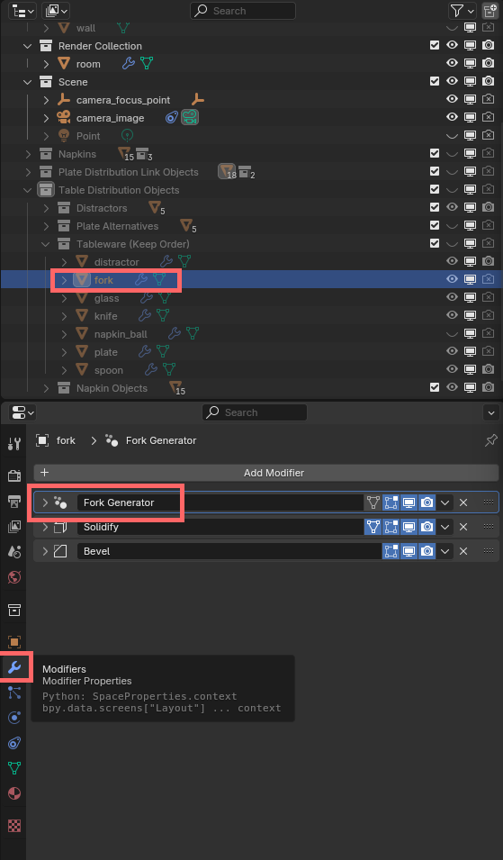

DiDiGen - Blender Addon
==

The Blender addon named "DiDiGen" comes with a Blender file and the addon to create images of randomized dining rooms and corresponding binary masks of visible clean and soiled plates in the images with the aim to create synthetic randomized datasets for training image segmentation models. Furthermore, a .csv-file will be created with additional information about each rendered scene such as the used materials, amount of forks on the table, etc.

# Requirement

### For Usage
- Blender 4.2.1
- Blender Addon: *Photographer 5.4.5*
  - https://chafouin.gumroad.com/l/photographer5
- The Blender file: "dining_scene_render.blend"
- The Addon .zip file: "didigen_addon.zip"

### For Development
- Blender 4.2.1
- Visual Studio Code
- VS Extension: "Blender Development" by Jacques Lucke
- Developed with Python 3.10.11 64-bit
  
- Helpful Links
  - Windows: https://www.youtube.com/watch?v=YUytEtaVrrc
  - Mac: https://www.youtube.com/watch?v=_0srGXAzBZE
  - Linux: https://www.youtube.com/watch?v=zP0s1i9EXeM

# Installation
- Blender 4.2.1: https://www.blender.org/download/lts/4-2/

- For the *Photographer* and *Dining Room Generator* Addon
  - Open Blender.
  - On the top left, open the tab `Edit` > `Preferences..`.
  - In the new opened Window called *Blender Preferences*, open the `Add-ons` tab on the left.
  - On the top right, click on the downward pointing arrow and select `Install from Disk..`.
  - Navigate to the git/addon folder and select `didigen.zip`.
  - The addon *Dining Room Generator* is activated if the checkmark is activated, next to the addon name, in the list of addons under the `Add-ons` tab.

# Settings
- Changing the Render Settings, so the CPU and GPU is used for rendering
  - Open Blender.
  - On the top left, open the tab `Edit` > `Preferences..`.
  - In the new opened Window called *Blender Preferences*, open the `System` tab on the left.
  - Under the first tab named `Cycles Render Devices`, select `OptiX` or `CUDA`.
  - Enable the listed CPU and GPU by clicking on the checkboxes left from the GPU and CPU names.

# Usage

After activating the addon *Dining Room Generator*, it can be found in the Viewport, which is the window that shows the 3D scene, on the bar on the right border.
It might be hidden and can be opened by pressing `N` or clicking on the small leftward pointing arrow, which opens the panel of the addon.

## How to render images
- Requirements:
  - The addons `Photographer` and `Dining Room Generator` must be activated.
  - The blender scene `dining_scene_render.blend` must be opened in Blender.
  - The object `room` in the collection `Render Collection` must be activated and visible in the 3D Viewport Window.

 

- Select the export folder for the rendered images, the corresponding binary masks and the datalogging csv file by pressing the `Set Export Path` button
  - For confirmation, the path of the export folder will be listed in the addon window.
- Set the starting index of the render images with the `Start Image Index` option
  - This option is important for the naming convention of the rendered images and the index in the .csv-file.
- The `Amount of Images` option sets how many images should be rendered in this session.
- Optional: Change the name of the csv-file that documents information of each rendered scene
- At last, press the `Render images` button and confirm the start of the rendering option.
  - Every customization option of the dining room scene will be automatically randomized. Afterwards, the rendering loop will be paused for twenty seconds and a preview of the scene will be rendered to determine the correct camera exposure with the `Photographer`-addon. After twenty seconds, the real rendering proces will start.

 

- **Warning**
  - During Rendering, please do not interact with the opened Blender scene to guarantee that the plugin is working.
  - To cancel the current rendering session, Blender must be closed and restarted, because the addon is in a rendering loop until all images are rendered.
  

## Dining Room Objects
The scene contains different collections, which can be seen on the top right in Blender. The collections contains the different objects that make up the dining room scene.

- Room
  - The `Room`-collection consist of the original chair, floor, table and wall object. Selecting the chair or table object will open the `Chair Characteristics` or `Table Characteristics`-tab in the `Dining Room Generator`-Panel. Opening the tabs will show the different customization options for the table and chairs of the dining room.
- Render Collection
  - This collection containts a single `room` object, which is used for rendering the dining room scene. Selecting the `room` object opens the `Room Characteristics`-tab in the `Dining Room Generator`-panel. The tab allows to customize the dining room characteristics.
- Scene
  - The `Scene`-collection contains the distributed light object for indoor lighting, the camera object and the focus point for the camera. The camera object can be selected to customize camera settings.

  

- Napkins
  - The `Napkins`-collection contains the different napkins objects that are distributed on the plates and the table. Napkins are either ball-shaped, slightly crumpled or folded. For each state, there exist five objects that are randomly crumpbled or folded.
- Plate Distribution Link Objects
  - The `Plate Distribution Link Objects`-collection contains links/references to objects that are placed on top of the plates.
- Table Distribution Objects
  - The `Table Distribution Objects`-collection contains objects that are randomly placed on top of the dining room table.
    - `Distractors`-collection contains five objects that are randomly shaped and have random generated materials that are used as distractor objects.
    - `Plate Alternatives`-collection contains the same plate with different objects placed on top of it for more complexity in the dining room scene.
    - `Tableware`-collection contains a `distractor`-, `fork`-, `glass`-, `knife`-, `napkin`-, `plate`-, `spoon`-object. Selecting the fork-, glass-, knife-, plate- or spoon-object opens the characteristics tab for each object in the `Dining Room Generator`-panel. The tab allows to customize the characteristics of each object.
    - `Napkin Objects`-collection contains links/references to objects that are placed on top of the table.

 

In case an option or characteristic is not visible, the `Modifier Properties`-tab can be opened for more details.

Additionally, the implemented technology can be inspected by changing the workspace in Blender from `Layout`-workspace to `Geometry Nodes`-workspace on the top of the Blender window.

## Materials
Materials of each object can be further customized (such as glossiness or metalness) going to the `Material Properties`-panel.

The implemented technology can be inspected by changing the workspace in Blender from `Layout`-workspace to `Shading`-workspace on the top of the Blender window. 
Each material was developed with *Shader Nodes*.

## Further Notes
- `Compositing`-Nodes under the `Composting`-workspace was used implement the rendering of the image and the corresponding binary mask.
- The implementation of the environment lighting can be found in the `Shading`-workspace and changing the *Shader Type* from `object` to `world`.
